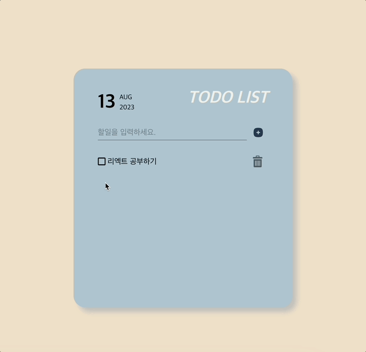

# TODO LIST

> 간단하게 할일을 추가하고 관리할 수 있는 페이지 입니다.

- 할일 추가, 체크, 삭제 가능

### getting started

`npm start`  
`npm test`  
`npm run build`  
URL : https://hhyanghh.github.io/react-todolist/

### Stack

`React`
 

### 사용환경

- 웹

### Updates

- 0813 1차배포
- (예정) : 할일 중요도 선택, Drag & Drop 형태로 목록의 순서 조정 기능
